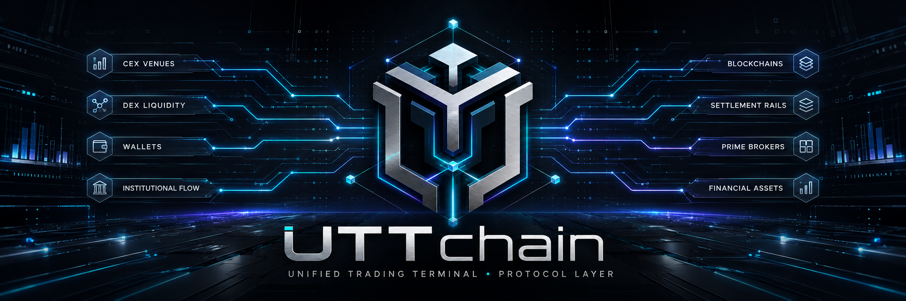
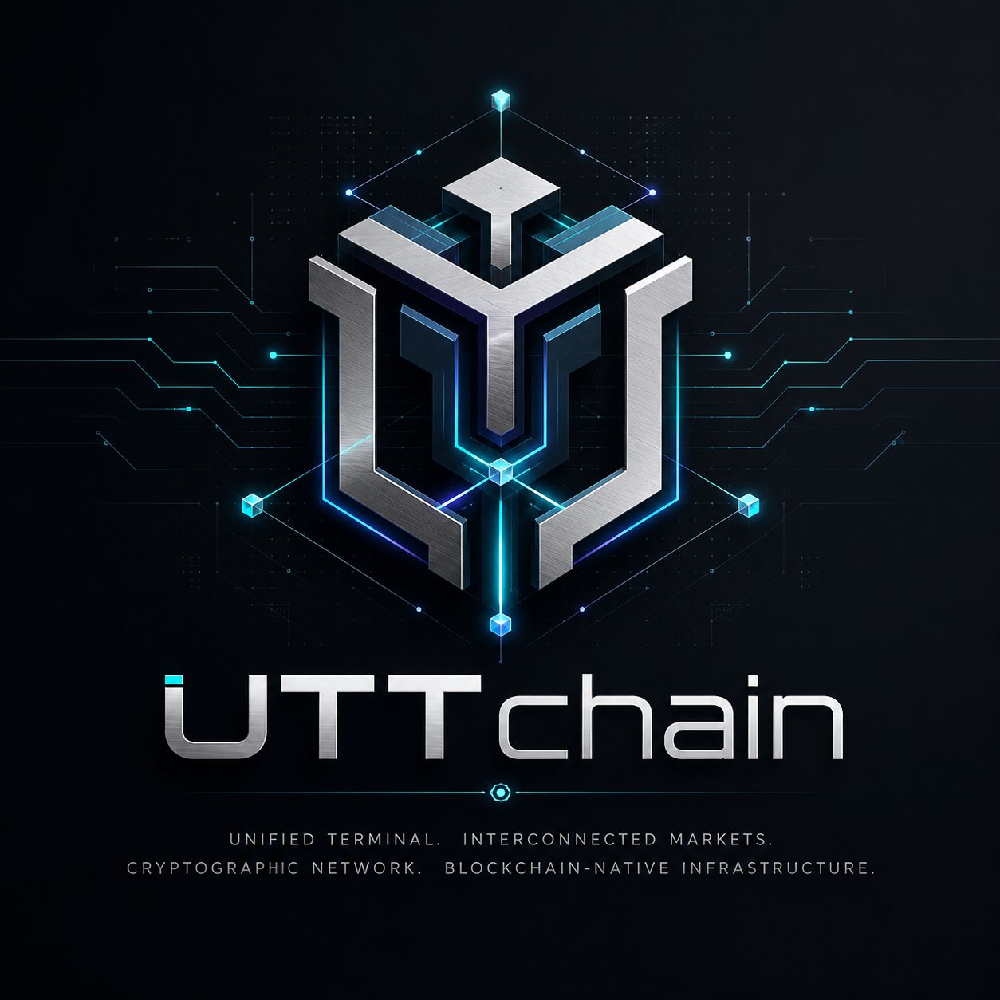
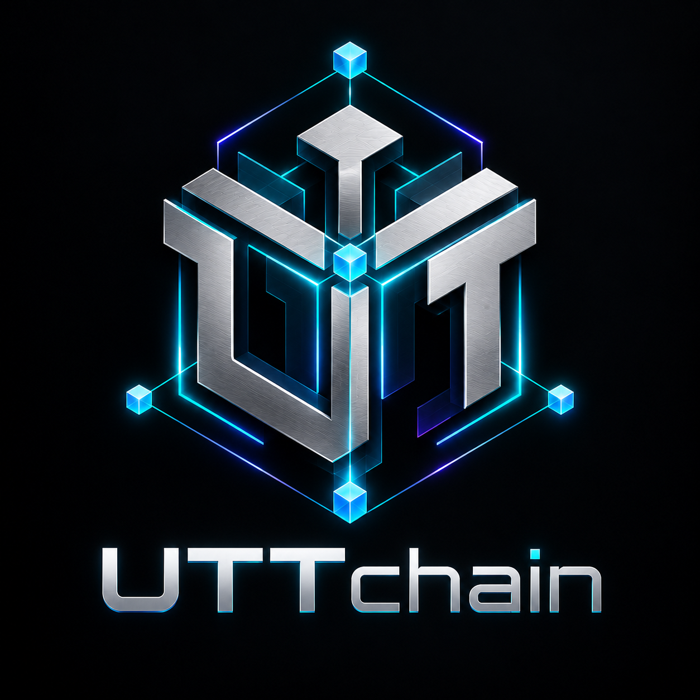

# UTTchain

<p align="center">
  
</p>

**UTTchain** is the Robinhood Chain protocol and infrastructure layer being developed for the **Unified Trading Terminal (UTT)** and **Unified Trading Terminal Token (UTTT)**.

> **Status — September 2026:** FOUNDATION / DESIGN. No UTTchain protocol deployment is live, no UTTT migration is authorized, and no existing UTTT deployment has yet been designated as the sole canonical supply.

## Overview

UTT is an existing local-first multi-venue trading terminal built with a React frontend and FastAPI backend. UTTchain is intended to extend that system into a secure, web-accessible, wallet-native architecture while using Robinhood Chain where blockchain execution provides a real trust, identity, settlement, or verification benefit.

UTTchain is **not** an attempt to run the entire UTT application inside smart contracts. Market-data aggregation, centralized-exchange APIs, relational accounting, FIFO/cost-basis logic, indexing, caching, background workers, and private user state remain off-chain. Robinhood Chain is intended to become the protocol layer for canonical identity, wallet-authorized execution, settlement, deployment identity, selected verifiable state, and UTTT infrastructure.

Existing UTT repository: https://github.com/eyemaginative/utt-unified-trading-terminal

## Visual identity

The UTTchain visual system represents **many markets → one terminal → one protocol** through a shared network/routing motif. The banner, visual-identity composition, primary logo, and compact icon are maintained as canonical project artwork under `images/`.

### Visual identity

<p align="center">
  
</p>

### Primary logo

<p align="center">
  
</p>

### Protocol icon

<p align="center">
  
</p>

Canonical artwork files:

```text
images/banner.png
images/visual_identity.png
images/logo.png
images/icon.png
```

## Architecture

```text
                         UTTchain
                Built on Robinhood Chain
                           |
          +----------------+----------------+
          |                |                |
          v                v                v
     WEB TERMINAL     UTT SERVICES      ON-CHAIN LAYER
       React/Vite       FastAPI         Robinhood Chain
          |                |                |
          |                |          +-----+------+
          |                |          |            |
          v                v          v            v
     Browser Wallet     Database     UTTT      UTTchain
     / Smart Account    + Workers    Layer     Contracts
          |                |
          |                +-- CEX APIs
          |                +-- Indexers
          |                +-- Market data
          |                +-- Ledger/FIFO
          |                +-- Automation
          |
          +------------- Robinhood Chain ------------+
```

The long-term boundary is intentionally hybrid:

- **Web client:** browser-delivered React/Vite terminal.
- **Application services:** FastAPI services for market data, accounting, routing, history, indexing, and other off-chain workloads.
- **Persistent state:** production-grade relational storage and worker/cache infrastructure, while local UTT may retain a local mode.
- **Wallet boundary:** browser-wallet or future smart-account authorization for blockchain transactions. The backend should not silently become the user's signer.
- **CEX boundary:** centralized-exchange credentials remain off-chain. A secure local execution agent is a preferred design candidate for preserving local custody of long-lived CEX credentials when UTT becomes web-accessible.
- **Protocol boundary:** Robinhood Chain contracts only where they add verifiable identity, settlement, permissions, state commitments, or other genuine protocol properties.

## Relationship to UTT

UTTchain does not replace UTT. It extends it.

```text
                 UNIFIED TRADING TERMINAL
                           UTT
                            |
             +--------------+--------------+
             |                             |
       Application Layer              Protocol Layer
             |                             |
        React / FastAPI                  UTTchain
             |                             |
      market data / CEX             Robinhood Chain
      accounting / DB                     |
      route computation          +--------+--------+
      indexing / workers         |        |        |
                                UTTT   Registry  Protocol
                                                Modules
```

The existing UTT codebase already contains Robinhood Chain functionality, including exact asset identity, registry-backed token handling, quote/execution context, browser-wallet transaction flows, receipt reconciliation, wallet-history ingestion, and order reconciliation. UTTchain gives that integration a separate protocol and security boundary.

## What belongs on-chain

Candidate responsibilities include:

- canonical UTTchain contract and deployment identities;
- UTTT identity and canonical-supply controls after multi-chain reconciliation;
- protocol configuration that benefits from public verifiability;
- exact chain/contract asset identity;
- wallet-authorized DEX settlement and related protocol actions;
- versioned capability declarations;
- selected cryptographic commitments to off-chain state;
- future account-abstraction or governance components if justified.

## What remains off-chain

UTTchain is not intended to publish or execute the following directly on a public blockchain:

- centralized-exchange API secrets;
- raw user portfolio history;
- FIFO lots and private tax records;
- private notes or strategies;
- high-frequency order-book polling;
- third-party HTTP API calls;
- large relational queries and caches;
- ordinary background jobs and indexers.

Private financial records should remain private unless a later protocol feature explicitly requires a privacy-preserving proof or commitment.

## UTTT: one canonical economic supply

UTTT already exists across multiple ecosystems, including:

- Robinhood Chain;
- Solana;
- the Polkadot ecosystem;
- Counterparty.

These assets are treated as **existing economic state that must be reconciled**, not disposable test deployments.

The design objective is:

```text
ONE UTTT
ONE ECONOMIC SUPPLY
MULTIPLE POSSIBLE EXECUTION DOMAINS
```

Before any deployment is declared canonical, the project will inventory each UTTT deployment or representation for identifier, issuer/deployer, current and historical supply, burns, holder distribution, treasury balances, liquidity, market pairs, bridge/migration history, and administrative authority.

Nominal supplies across chains will not simply be added together. Burned, escrowed, bridged, mirrored, or otherwise non-independent supply must be identified so economic UTTT is not double counted.

Potential future models include lock-and-mint representations, a canonical supply ledger spanning existing assets, deterministic holder migration, or a hybrid model preserving economically meaningful legacy markets. **No model is selected yet.** Existing holder interests and verifiable supply evidence come first.

## Planned protocol components

### UTTT

A reviewed existing deployment or a locally built canonical implementation, depending on the multi-chain forensic review. If a new Robinhood Chain implementation is required, the intended path is Solidity/OpenZeppelin/Foundry with unit, fuzz, invariant, static-analysis, testnet, and deployment-reconciliation gates.

### UTTchain Registry

A compact on-chain registry for identities that genuinely benefit from public authority, including canonical UTTchain component deployments, UTTT deployment identity, chain/contract identities, protocol versions, and capability declarations.

### Deployment manifests

Production-relevant deployments should produce machine-readable evidence including chain ID, address, deployment transaction, block, runtime identity/hash, compiler configuration, source commit, constructor arguments, and verification state.

### Future account layer

ERC-4337 and related account-abstraction capabilities may later be evaluated for programmable wallets, batching, session keys, gas sponsorship, and bounded permissions. These are future capabilities, not current production claims.

### Future state commitments

UTT may eventually commit cryptographic roots of selected accounting/application states to Robinhood Chain without publishing the underlying private records.

## Security model

Standing security invariants:

- **No private keys or seed phrases in GitHub.**
- **No production exchange secrets in GitHub or frontend bundles.**
- **No CEX API credentials on-chain.**
- **No automatic blockchain signing by the UTTchain backend.**
- **No unlimited token approvals by default.**
- **No ticker/symbol-only asset authority.** Chain and contract identity matter.
- **No silent mainnet broadcasts.**
- **No automatic financial retry after transaction authority becomes uncertain.**
- **No undocumented privileged contract roles.**
- **No unreviewed proxy or upgrade authority.**
- **No public disclosure of private user financial records merely to make them on-chain.**
- **No production deployment from uncommitted or unreconciled source.**
- **No UTTT holder migration before supply and ownership reconciliation.**

Production security review will cover smart-contract behavior as well as web authentication, authorization, multi-user isolation, database boundaries, credential handling, RPC/provider trust, and transaction reconciliation.

## Development-state vocabulary

```text
CONCEPT
SPECIFIED
IMPLEMENTED
TEST-GREEN
TESTNET DEPLOYED
MAINNET DEPLOYED
ACTIVATED
PRODUCTION ACCEPTED
```

A deployed contract does not by itself mean UTTchain is launched. A website being online does not by itself authorize production trading.

## Development lifecycle

```text
specification
    |
local implementation
    |
unit + fuzz + invariant testing
    |
static analysis
    |
fork / read-only integration
    |
Robinhood Chain testnet
    |
deployment reconciliation
    |
production security review
    |
explicit mainnet authorization
```

## Roadmap

### Foundation
- **UTTC.INIT** — repository, security baseline, README, public project announcement, Foundry bootstrap.
- **UTTC.0** — architecture, application/protocol boundary, trust boundaries, privacy model, threat model.

### UTTT canonicalization
- **UTTC.1** — forensic/supply intake for Robinhood Chain, Solana, Polkadot, and Counterparty UTTT.
- **UTTC.2** — one-canonical-supply and migration architecture.
- **UTTC.3** — canonical UTTT specification.
- **UTTC.4** — implementation and security testing if a replacement/new canonical contract is required.

### Protocol foundation
- **UTTC.5** — UTTchain Registry.
- **UTTC.6** — deployment-manifest standard.
- **UTTC.7** — Robinhood Chain testnet deployments and reconciliation.
- **UTTC.8** — UTT ↔ UTTchain integration adapter.

### Web architecture
- **UTTC.9** — web-service deployment boundary.
- **UTTC.10** — production relational-storage architecture.
- **UTTC.11** — multi-user isolation and authorization.
- **UTTC.12** — secure local CEX execution-agent architecture.
- **UTTC.13** — wallet-native authentication.
- **UTTC.14** — browser-wallet Robinhood Chain execution from the web terminal.
- **UTTC.15** — durable Robinhood Chain indexing infrastructure.

### Advanced protocol work
- **UTTC.16** — cryptographic accounting/state commitments.
- **UTTC.17** — ERC-4337/account abstraction.
- **UTTC.18** — evidence-driven UTTT utility design.
- **UTTC.19** — governance architecture if justified.

### Production
- **UTTC.20** — production security review.
- **UTTC.21** — mainnet deployment preflight.
- **UTTC.22** — explicitly authorized mainnet protocol deployment.
- **UTTC.23** — production web deployment.
- **UTTC.24** — end-to-end production acceptance.
- **UTTC.25** — post-launch operations and release/security management.

## Target repository structure

```text
UTTchain/
+-- README.md
+-- SECURITY.md
+-- CONTRIBUTING.md
+-- foundry.toml
+-- src/
+-- test/
+-- script/
+-- deployments/
+-- docs/
+-- abi/
+-- images/
```

The structure above is a target, not a claim that every component already exists.

## Current status

As of this initial repository publication:

- UTTchain architecture is being specified;
- the repository is being bootstrapped;
- no UTTchain protocol contract is live;
- no UTTT migration is authorized;
- no existing UTTT deployment has been declared the sole canonical supply;
- no liquidity or market action is authorized by this repository;
- the existing UTT application remains a separate active project and reference implementation.

## License

A project license has not yet been finalized for UTTchain. Until an explicit license is added, do not assume rights beyond those provided by applicable law and GitHub's terms for public repositories.

## Disclaimer

UTTchain is experimental software under active development. Repository documentation describes architecture and development intent, not a promise of future functionality or a representation that any protocol, token migration, market, or trading service is live. Nothing in this repository is investment, tax, or legal advice.
